:title: Jagjeet Singh 
:data-transition-duration: 1500
:css: hovercraft.css

*6-month Training*
===================================

Jagjeet Singh

141034

1411266

----

*I worked on two main projects*
===================================
 
* thepoet.me - A personal identity page for poets.
* plzalert.me - Notification app for T&P Cell, GNDEC
* Nitnem - Android Application of selected Sikh hymns

----

thepoet.me
==========================

----

Existing system
============================

At present, there is no **domain** that represent **poets**.

----

Proposed solution to the problem
=================================

A service provided to poets that offer them a personal identity page.

----

A single URL that represent a user.  
**https://thepoet.me/thomasgimpel**.

----

:data-x: r0
:data-y: r+1000

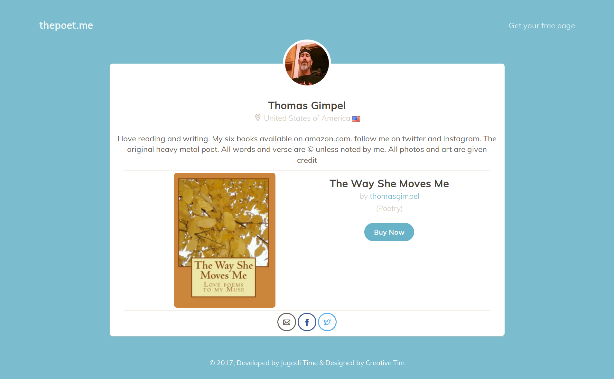

----

:data-x: r+1500
:data-y: r-1000

The homepage is user friendly any new user visiting our site can comprehent what we provide.

----

:data-x: r+1500
:data-y: r0

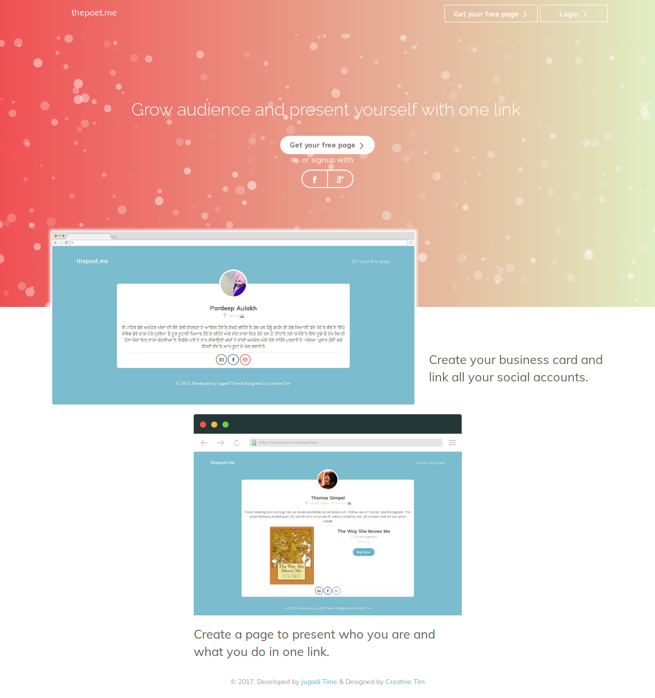

----

:data-x: r0
:data-y: r+1000

Functions of site
=====================

----

:data-x: r+1500

Login Page
================

----

:data-x: r0
:data-y: r+1000

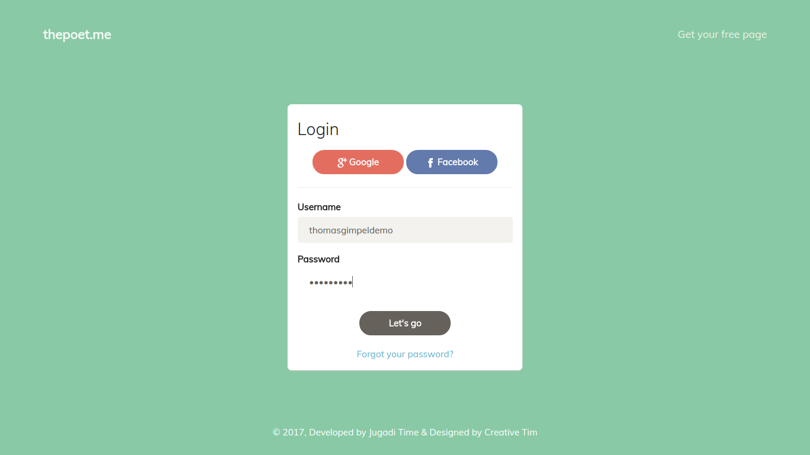

----

:data-x: r+1500
:data-y: r-2000

Signup Page
================

----

:data-x: r0
:data-y: r+1000

----

:data-x: r+1500
:data-y: r-2000

Logged In user Page
=====================

----

:data-x: r0
:data-y: r+1000

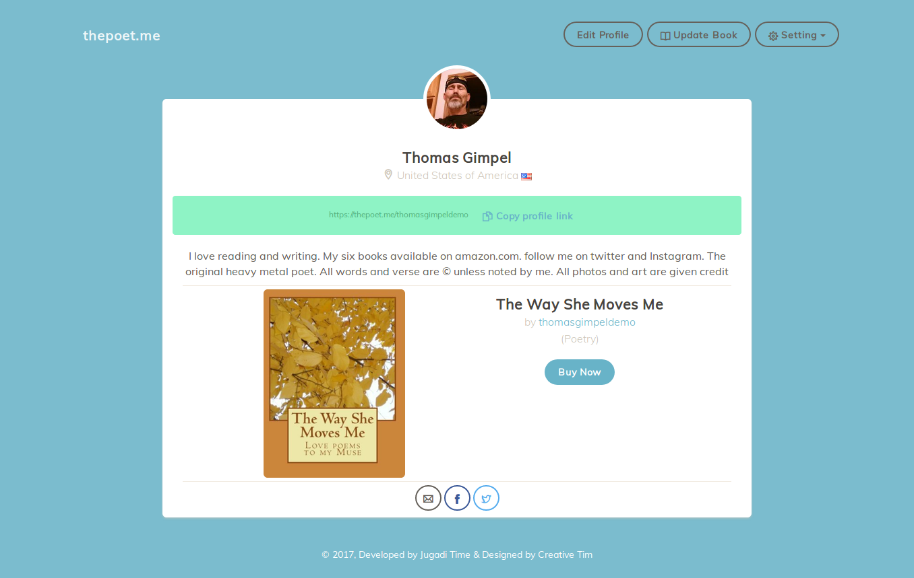

----

:data-x: r+1500
:data-y: r-2000

Edit Profile Page
===================

----

:data-x: r0
:data-y: r+1000

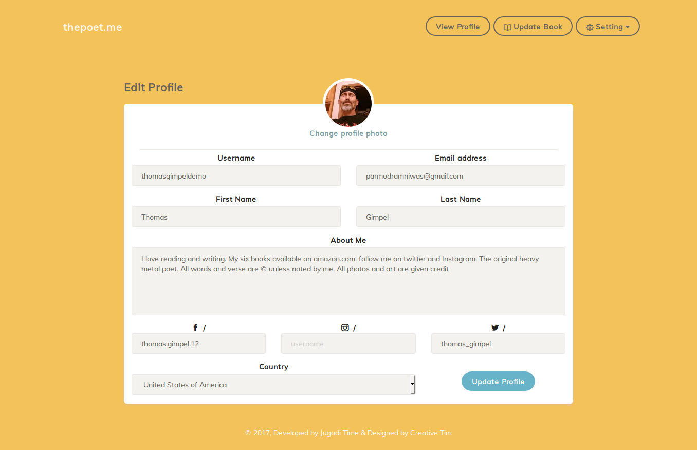

----

:data-x: r+1500
:data-y: r-2000

Add Book Page
================

----

:data-x: r0
:data-y: r+1000

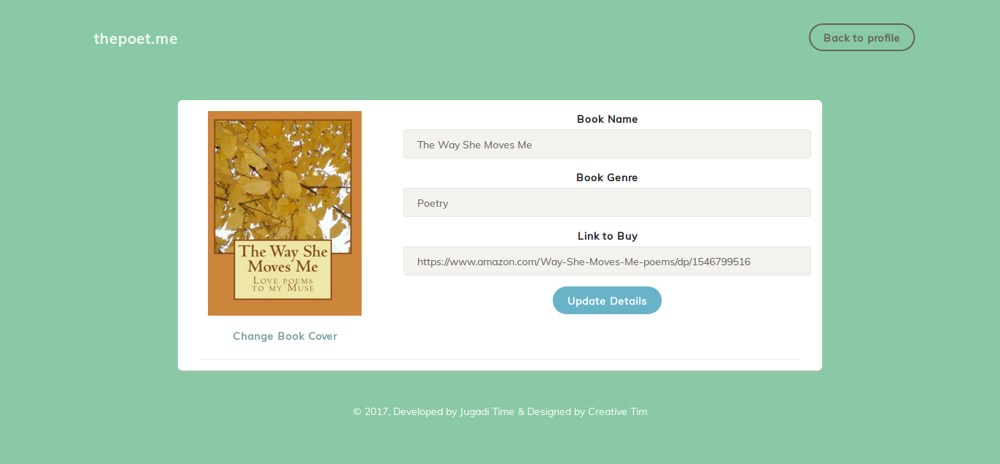

----

:data-x: r+1500
:data-y: r-2000

Change Password Page
====================

----

:data-x: r0
:data-y: r+1000

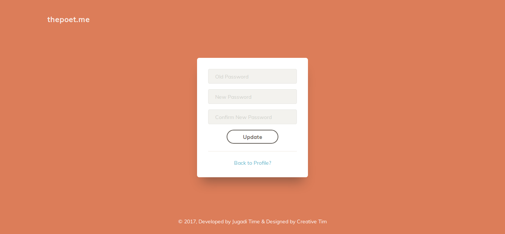

----

:data-x: r+1500
:data-y: r-2000

With this, I completed my first project.
==========================================

* **Code**: https:github.com/iamjagjeetubhi/thepoetdotme

----

:data-y: r0

plzalert.me
=====================

----

Existing system
============================

At present, the existing system is only Facebook Page.

----

Placement for some students is very important. So, regular notification on a Facebook Page is unprofessional and unappealing

----

Mobile No. Registration

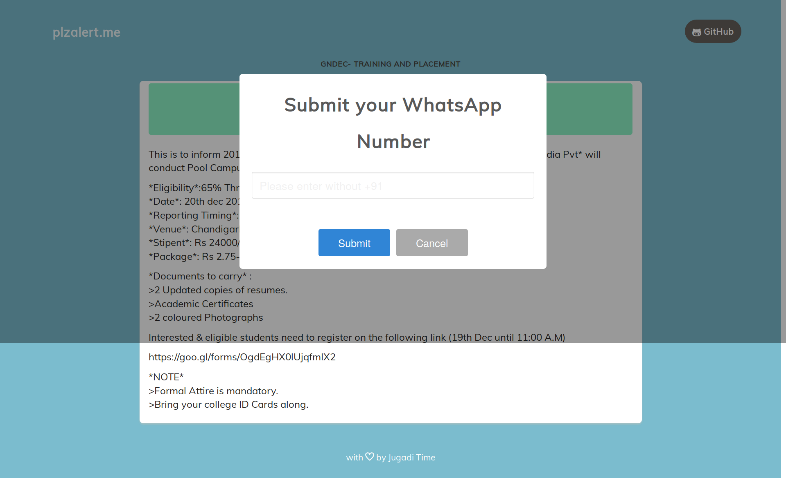

----

Mobile No. Validation for invalid no.

----

Mobile No. Validation if no. already exists

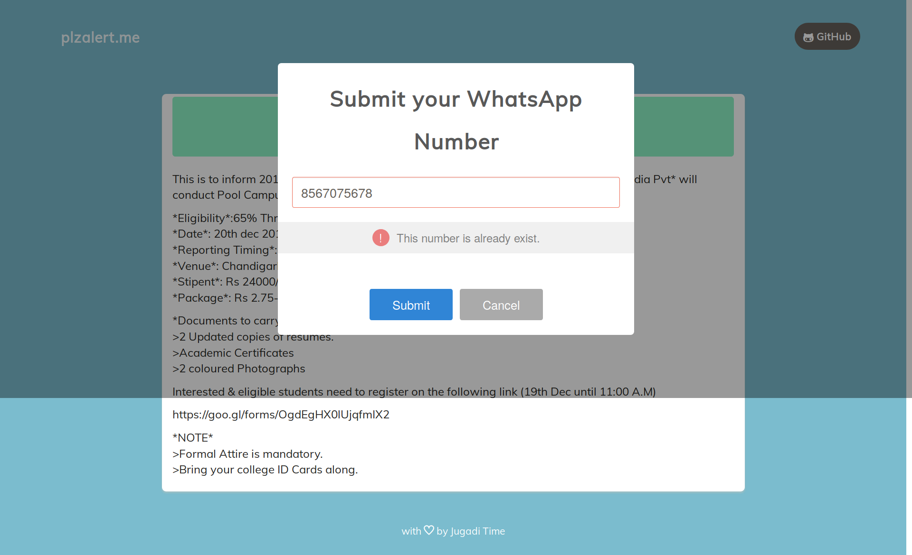

----

Successfull Registration

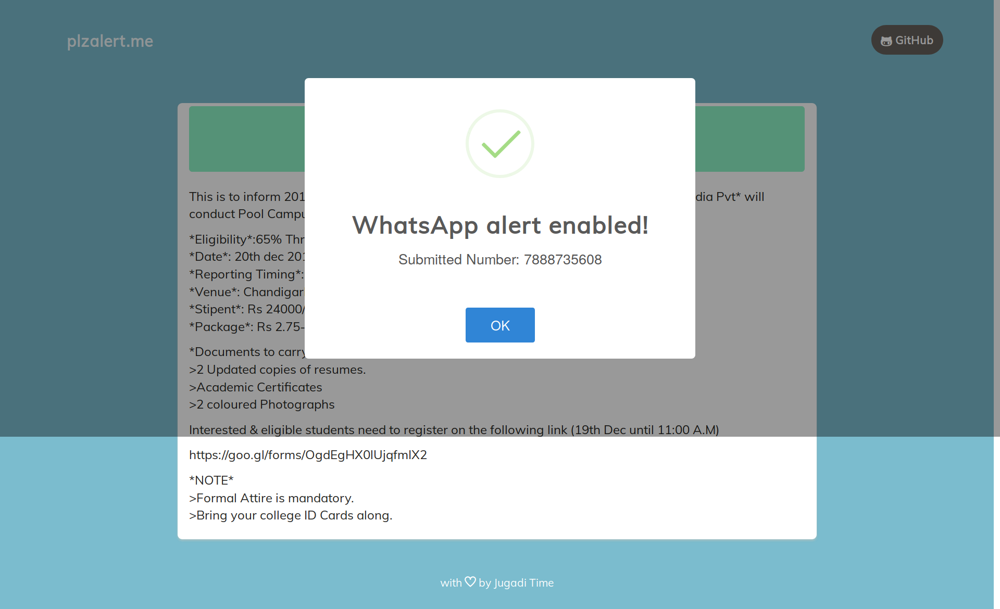

----

Latest post from T&P Facebook Page

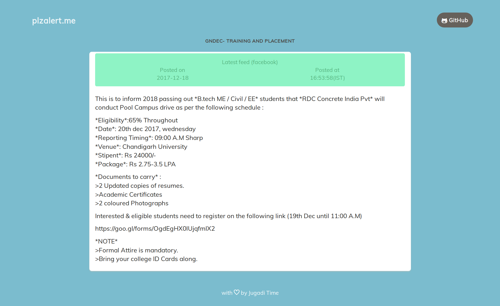

----

With this, I completed my last project.
===========================================

* **Source Code**: https:github.com/iamjagjeetubhi/plzalertdotme

----

Thank you...
=============
